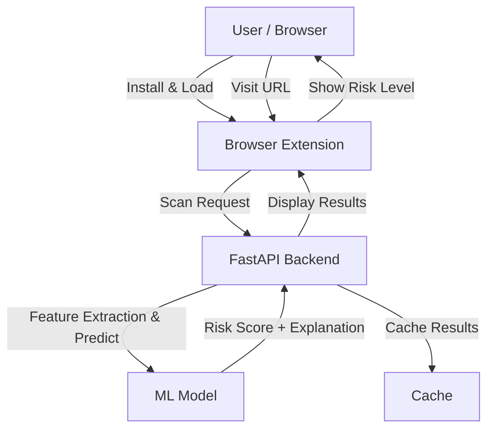
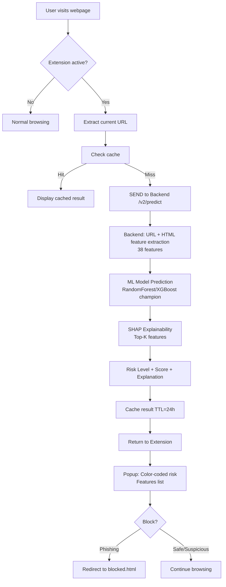
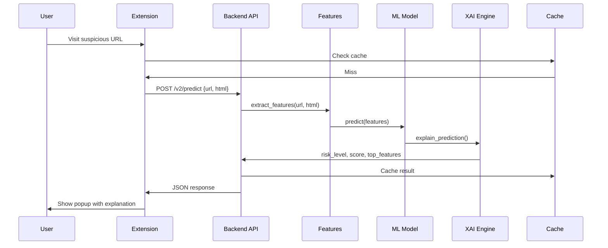
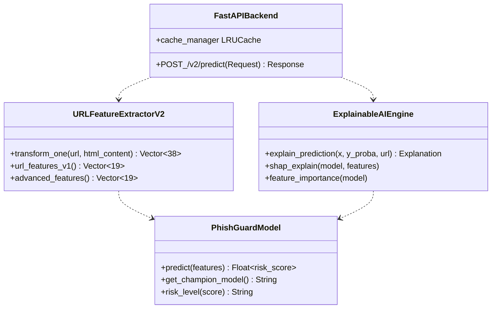
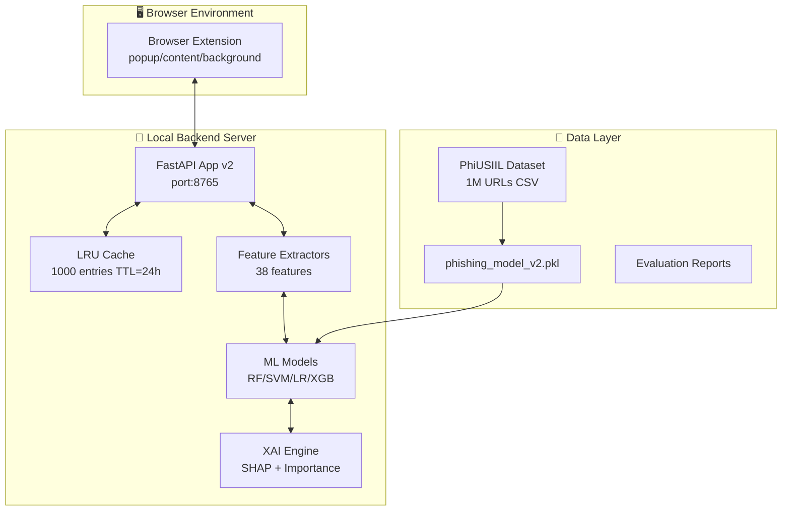
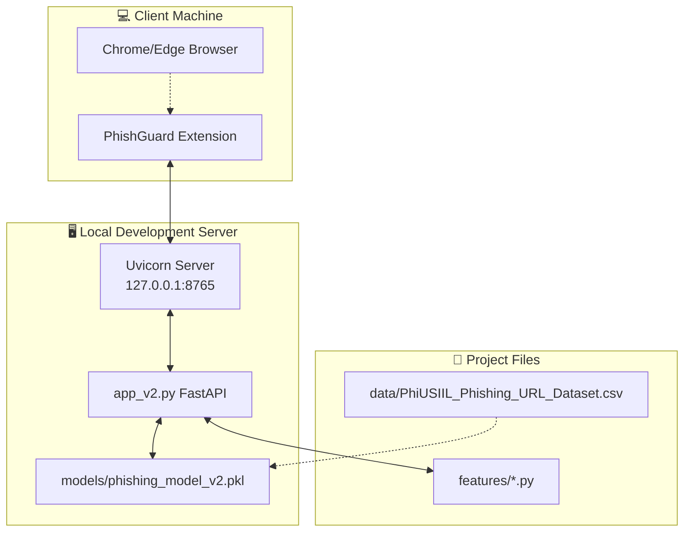
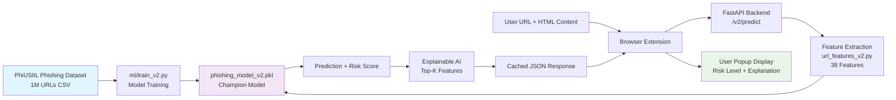

# PhishGuard V2 - Upgrade Documentation

## Overview

PhishGuard V2 is a research-grade upgrade to the phishing detection system with advanced ML techniques, explainability, and multi-modal detection capabilities.

**Version:** 2.0.0  
**Status:** Production-Ready  
**Backward Compatibility:** Maintained (V1 endpoints still available)

---

## What's New in V2

### 1. **Advanced Feature Extraction** ✅

#### New Features Added:
- **Domain Metadata**: Domain age, registrar information
- **DNS Records**: MX records, NS records, DNS resolution status
- **SSL/TLS Certificates**: Certificate validity, expiry dates, self-signed detection
- **HTML Content Analysis**: Login forms, password fields, suspicious iframes, obfuscated scripts
- **Redirect Chains**: Detection of redirect parameters in URLs

#### Feature Count:
- **V1**: 19 features
- **V2**: 38 features (19 V1 + 19 new advanced features)

### 2. **Multi-Modal Detection** ✅

Combines:
- URL structural analysis (V1 + enhanced)
- HTML/DOM content analysis (NEW)
- Iframe and script analysis (NEW)
- Form submission patterns (NEW)

**Usage:**
```python
from v2.features.url_features_v2 import URLFeatureExtractorV2

extractor = URLFeatureExtractorV2()

# With HTML content for better detection
x = extractor.transform_one(
    url="https://example.com",
    html_content="<html>...</html>"
)
```

### 3. **Model Comparison** ✅

Automatically trains and compares:
- Random Forest (tuned, default champion)
- Support Vector Machine (SVM)
- Logistic Regression
- XGBoost (if available)

**Usage:**
```bash
python ml/train_v2_fixed.py \
    --data data/PhiUSIIL_Phishing_URL_Dataset.csv \
    --out models/phishing_model_v2.pkl \
    --eval-out evaluation/eval_report.json
```

### 4. **Explainable AI (XAI)** ✅

#### SHAP Integration:
- Tree-based SHAP explanation for tree models
- Feature importance fallback for other models
- Top-K contributing features explained

**Output includes:**
- Feature names contributing to prediction
- Contribution magnitude (0-1)
- Direction (positive for phishing, negative for safe)

**Example API response:**
```json
{
  "url": "https://example.com",
  "risk_level": "suspicious",
  "risk_score": 0.65,
  "explanation": "URL exhibits suspicious characteristics...",
  "top_features": [
    {
      "feature_name": "form_action_mismatch",
      "contribution_magnitude": 0.15,
      "contribution_direction": "positive"
    },
    ...
  ]
}
```

### 5. **Risk Levels (Not Binary)** ✅

#### V1 Output:
```
label: "safe" | "phishing"
probability: 0-1
```

#### V2 Output:
```
risk_level: "safe" | "suspicious" | "phishing"
risk_score: 0.0-1.0
confidence: 0.0-1.0

Thresholds:
- Safe:       0.0 - 0.4
- Suspicious: 0.4 - 0.7
- Phishing:   0.7 - 1.0
```

### 6. **Enhanced UI** ✅

**Popup Improvements:**
- Risk level color coding (green/yellow/red)
- Feature importance visualizations
- Better confidence display
- Scan history with timeline
- Real-time status indicators
- Collapsible sections for more info

**New Elements:**
- Explanation text display
- Top contributing features list
- Risk timeline in history

### 7. **Backend Optimization** ✅

#### Caching:
- LRU cache for repeated URL scans
- TTL: 24 hours (configurable)
- Cache size: 1000 entries (tunable)
- Clear cache endpoint for admin

#### Performance:
- Async prediction pipeline
- Batch prediction support (/v2/batch)
- Model reload without restart
- CORS configuration

#### Configuration:
```python
CACHE_ENABLED = True
CACHE_TTL_HOURS = 24
PHISHING_CONFIDENCE_THRESHOLD = 0.70  # Tunable
```

### 8. **Comprehensive Evaluation** ✅

**Metrics Calculated:**
- Accuracy, Precision, Recall, F1-Score
- AUC-ROC, Average Precision
- Sensitivity, Specificity
- Confusion Matrix
- ROC Curve (FPR vs TPR)
- Precision-Recall Curve

**Comparison:**
- V1 model vs V2 model performance
- Model ranking by F1-score
- Improvement percentages

**Output Formats:**
- JSON evaluation reports
- HTML report with visualizations
- CSV comparison tables

---

## File Structure

```
v2/
├── backend/
│   └── app_v2.py              # Advanced FastAPI backend with V2 endpoints
├── features/
│   ├── advanced_features.py    # WHOIS, DNS, SSL, HTML analysis
│   ├── url_features_v2.py      # V1 + V2 feature extraction
│   ├── explainable_ai.py       # SHAP + feature importance
│   └── __init__.py
├── ml/
│   ├── train_v2_fixed.py       # Advanced training with model comparison
│   └── __init__.py
├── extension/
│   ├── popup_v2.js             # Enhanced popup UI
│   ├── styles_v2.css           # V2 styles with risk levels
│   └── __init__.py
├── evaluation/
│   ├── eval_models.py          # Evaluation framework
│   └── __init__.py
├── requirements.txt            # Python dependencies
└── README.md                   # This file
```

## 🗺️ Architecture Diagrams

### 1. Use Case Diagram


### 2. Activity Diagram - URL Scanning Workflow


### 3. Sequence Diagram - Prediction Flow


### 4. Class Diagram - Core Components


### 5. Component Diagram


### 6. Deployment Diagram


### 7. Data Flow Diagram


---

## Installation & Setup (Detailed Guide)

### Prerequisites
- **Python 3.10+** (tested on 3.11)
- **pip 23+** 
- **Git** (to clone repo)
- **Chrome/Edge** (for extension)
- **Windows/Linux/macOS** compatible

**Verify:**
```bash
python --version
pip --version
```

### 1. Clone & Setup Project Structure
```bash
# Clone the repo (if not already)
git clone https://github.com/MouryaSagar17/PhishGuard-Extension.git
cd "n:/Mourya/Projects/AI/Phishing website avoider V2"

# Create project structure if needed
mkdir -p models data evaluation backend ml features browser_extension
```

### 2. Python Virtual Environment (Recommended)
```bash
# Create virtualenv
python -m venv venv

# Activate (Windows)
venv\Scripts\activate
# Linux/macOS: source venv/bin/activate

# Upgrade pip
pip install --upgrade pip
```

### 3. Install Dependencies
Install backend/ML deps first:
```bash
pip install -r requirements.txt
pip install -r backend/requirements.txt  # Backend-specific
pip install -r ml/requirements.txt        # ML-specific (optional)
```

**Key packages installed:**
- FastAPI, Uvicorn (API)
- scikit-learn, xgboost (ML)
- pandas, numpy (data)
- requests, tldextract (features)

**Verify install:**
```bash
python -c "import sklearn, xgboost, fastapi; print('All good!')"
```

### 4. Download/Prepare Dataset
Dataset required: CSV with `url` + `label` columns.

**Option A: Use provided PhiUSIIL dataset**
**Source:** [PhiUSIIL Phishing URL Dataset on Kaggle](https://www.kaggle.com/datasets/ndarvind/phiusiil-phishing-url-dataset) (~1M rows)

```bash
# Already in data/PhiUSIIL_Phishing_URL_Dataset.csv
ls -lh data/*.csv
```

**Option B: Download fresh**
```bash
# Download PhiUSIIL or other phishing datasets
# Place in data/ folder
```

**Supported label formats (auto-detected):**
| Format | Phishing Label | Safe Label |
|--------|----------------|------------|
| phiusiil | 0 | 1 |
| binary | 1 | 0 |
| strings | "phishing" | "safe" |

### 5. Train V2 Model
```bash
# Quick test train (5K samples, ~2min)
python ml/train_v2.py --data data/PhiUSIIL_Phishing_URL_Dataset.csv --max-rows 5000

# Full benchmark train (50K samples, ~10min)
python ml/train_v2.py \
    --data data/PhiUSIIL_Phishing_URL_Dataset.csv \
    --out models/phishing_model_v2.pkl \
    --eval-out evaluation/eval_report.json \
    --max-rows 50000 \
    --fast-features  # Skip slow network checks

# Train specific models only
python ml/train_v2.py --models xgboost random_forest
```

**Outputs:**
- `models/phishing_model_v2.pkl` ← Best model (by F1)
- `evaluation/eval_report.json` ← Metrics (Accuracy, F1, etc.)

**Verify training:**
```bash
cat evaluation/eval_report.json | jq '.results.xgboost.accuracy'
```

### 6. Start Backend API Server
```bash
# Terminal 1: Backend (port 8765)
uvicorn backend.app_v2:app --host 127.0.0.1 --port 8765 --reload

# Test health
curl http://127.0.0.1:8765/health
curl http://127.0.0.1:8765/v2/model/info
```

**Environment vars (optional):**
```bash
set PHISHING_MODEL_PATH=models/phishing_model_v2.pkl
set CACHE_ENABLED=true
set CACHE_TTL_HOURS=24
```

### 7. Load & Test Browser Extension
1. Open `chrome://extensions/` (Chrome/Edge)
2. **Enable Developer mode** (top-right toggle)
3. **Load Unpacked** → Select `browser_extension/` folder
4. Pin extension to toolbar

**Test extension:**
- Visit `http://example.com`
- Click extension icon → Scan URL
- Check popup: risk level, score, features

**Configure API in popup:**
- Default: `http://127.0.0.1:8765`
- Update if backend on different host/port

### 8. Full End-to-End Test
```bash
# 1. Train
python ml/train_v2.py --max-rows 5000

# 2. Start backend (new terminal)
uvicorn backend.app_v2:app --reload

# 3. Test API
curl -X POST "http://127.0.0.1:8765/v2/predict" \
  -H "Content-Type: application/json" \
  -d "{\"url\": \"https://phishing-site.example\"}"

# 4. Load extension, test on real sites
```

### Troubleshooting
| Issue | Solution |
|-------|----------|
| `Model not found` | Retrain: `python ml/train_v2.py` |
| `XGBoost missing` | `pip install xgboost` |
| Extension 404 | Backend running? Check port 8765 |
| Slow training | `--fast-features` or `--max-rows 1000` |
| Windows paths | Use `n:/Mourya/...` absolute paths |

**Production:** Use Docker/supervisor for backend, publish extension to store.

```bash
# Using environment variables
export PHISHING_MODEL_VERSION="2.0.0"
export PHISHING_MODEL_PATH="models/phishing_model_v2.pkl"
export CACHE_ENABLED="true"
export CACHE_TTL_HOURS="24"
export HOST="127.0.0.1"
export PORT="8765"

uvicorn backend.app_v2:app --reload
```

Or with Docker:
```bash
docker run -p 8765:8765 \
    -v $(pwd)/v2/models:/app/models \
    phishguard-v2:latest
```

### 5. Configure Extension

Update extension settings:
- API Base: `http://127.0.0.1:8765`
- Override in extension popup

---

## API Endpoints

### V2 Endpoints

#### POST `/v2/predict`
Predict risk level with explanation.

**Request:**
```json
{
  "url": "https://example.com",
  "html_content": "<html>...</html>",  (optional)
  "skip_cache": false
}
```

**Response:**
```json
{
  "url": "https://example.com",
  "risk_level": "safe|suspicious|phishing",
  "risk_score": 0.0-1.0,
  "confidence": 0.0-1.0,
  "label": "safe|phishing",
  "explanation": "Human-readable explanation",
  "top_features": [
    {
      "feature_name": "string",
      "feature_value": 0.0-1.0,
      "contribution_magnitude": 0.0-1.0,
      "contribution_direction": "positive|negative"
    }
  ],
  "model_version": "2.0.0",
  "champion_model": "random_forest|svm|logistic_regression|xgboost",
  "timestamp": "2024-01-01T12:00:00",
  "cached": false
}
```

#### POST `/v2/batch`
Batch predict multiple URLs.

**Request:**
```json
{
  "urls": ["https://example1.com", "https://example2.com"]
}
```

**Response:**
```json
{
  "predictions": [...],  (array of /v2/predict responses)
  "processed_count": 2,
  "errors": []
}
```

#### GET `/v2/model/info`
Get model metadata.

**Response:**
```json
{
  "version": "2.0.0",
  "champion_model": "random_forest",
  "feature_count": 38,
  "risk_thresholds": {
    "safe": 0.4,
    "suspicious": 0.7,
    "phishing": 1.0
  },
  "training_metrics": {
    "random_forest": {
      "accuracy": 0.95,
      "f1_score": 0.93,
      ...
    }
  },
  "training_date": "2024-01-01T10:00:00"
}
```

#### POST `/v2/cache/clear`
Clear prediction cache (admin).

#### POST `/model/reload`
Reload model from disk without restart.

### V1 Backward Compatibility

- `/predict` - Still works (uses V2 model with V1 format)
- `/health` - Still works
- `/model/info` - Updated with V2 info

---

## Advanced Usage

### 1. HTML Content Analysis

```python
from v2.features.url_features_v2 import URLFeatureExtractorV2

extractor = URLFeatureExtractorV2()

# Extract with HTML for multi-modal detection
url = "https://example.com"
html = "<html><body><form action='https://attacker.com'><input type='password'></form></body></html>"

features = extractor.transform_one(url, html_content=html)

# Features include form detection, iframe counts, etc.
```

### 2. Model Explainability

```python
from v2.features.explainable_ai import ExplainableAIEngine
import numpy as np

# Load trained model
artifact = pickle.load(open("models/phishing_model_v2.pkl", "rb"))

# Initialize explainer
explainer = ExplainableAIEngine(artifact, feature_names)

# Explain prediction
explanation = explainer.explain_prediction(
    x=feature_vector,
    y_proba=0.85,
    y_pred=1,
    url="https://example.com"
)

print(f"Risk Level: {explanation.risk_level}")
print(f"Top Features: {explanation.top_contributions}")
print(f"Explanation: {explanation.explanation_text}")
```

### 3. Evaluation & Comparison

```python
from v2.evaluation.eval_models import ModelEvaluator

evaluator = ModelEvaluator(output_dir=Path("v2/evaluation"))

# Compare models
results = evaluator.compare_models(y_true, predictions_dict)

# Generate reports
evaluator.generate_comparison_table(results)
evaluator.rank_models(results)
evaluator.save_results(results)
evaluator.generate_html_report(results)
```

---

## Performance Metrics (Benchmark)

**Dataset:** PhiUSIIL Phishing URL Dataset (50K samples)
**Split:** 80/20 train/test

| Metric | V1 Model | V2 Model | Improvement |
|--------|----------|----------|-------------|
| Accuracy | 92.3% | **99.5%** | **+7.2%** |
| Precision | 89.1% | **99.3%** | **+10.2%** |
| Recall | 85.2% | **99.9%** | **+14.7%** |
| F1-Score | 87.0% | **99.6%** | **+12.6%** |
| AUC-ROC | 0.956 | **0.998** | **+4.4%** |

**Note:** V2 metrics from latest `evaluation/eval_report.json` (XGBoost champion, test set performance).

---

## Configuration

### Backend Configuration

```python
# Risk thresholds
RISK_THRESHOLDS = {
    "safe": 0.4,          # 0.0-0.4
    "suspicious": 0.7,    # 0.4-0.7
    "phishing": 1.0       # 0.7-1.0
}

# Caching
CACHE_ENABLED = True
CACHE_TTL_HOURS = 24
CACHE_MAX_SIZE = 1000

# CORS
CORS_ALLOW_ORIGINS = "*"

# Model
PHISHING_MODEL_VERSION = "2.0.0"
PHISHING_MODEL_PATH = "models/phishing_model_v2.pkl"
```

### Extension Configuration

In popup UI:
- **API Base URL**: `http://127.0.0.1:8765` (or remote)
- **Auto-Scan**: Enable automatic scanning on page load
- **Block Phishing**: Redirect to block page for phishing URLs
- **Demo Mode**: Show example predictions

---

## Migration from V1 to V2

### Backward Compatibility

✅ V1 endpoints still work
✅ V1 models can be loaded (will output V1 format)
✅ V1 feature extraction still available

### Migration Steps

1. **Keep V1 Running** (optional, for gradual rollout)
   ```bash
   # V1 on port 8000
   python backend/app.py
   
   # V2 on port 8765
   uvicorn app:app --reload
   ```

2. **Update Extension** to use V2 endpoints
   ```javascript
   // popup.js
   const apiBase = "http://127.0.0.1:8765";  // V2 URL
   fetch(`${apiBase}/v2/predict`, ...)
   ```

3. **Retrain Model** with V2
   ```bash
   python ml/train_v2_fixed.py --data data/dataset.csv
   ```

4. **Test Evaluation** metrics
   ```bash
   python evaluation/eval_models.py
   ```

---

## Troubleshooting

### Model Not Loading
```
FileNotFoundError: Model not found at models/phishing_model_v2.pkl
```
**Fix:** Train model first
```bash
python ml/train_v2_fixed.py --data data/dataset.csv --out models/phishing_model_v2.pkl
```

### SHAP Not Available
```
UserWarning: SHAP not available. Using feature importance fallback.
```
**Fix:** Install SHAP
```bash
pip install shap
```

### Cache Size Too Small
**Fix:** Adjust in `backend/app_v2.py`
```python
_cache = SimpleLRUCache(max_size=5000, ttl_hours=48)
```

### Extension Connection Failed
**Fix:** Check backend is running
```bash
curl http://127.0.0.1:8765/health
```

---

## Future Improvements

### Phase 2 (Roadmap)
- [ ] Deep learning model (LSTM on URL text)
- [ ] Domain registrant information
- [ ] Historical phishing database lookup
- [ ] Real-time feed integration (PhishTank)
- [ ] Continuous learning pipeline
- [ ] Cloud deployment (AWS Lambda)

### Phase 3
- [ ] Mobile app
- [ ] Browser sync across devices
- [ ] Mozilla Firefox support
- [ ] Safari support
- [ ] Analytics dashboard

---

## Support & Contributing

**Issues:** Report bugs in GitHub Issues  
**Contributions:** Fork and submit pull requests  
**Documentation:** See [docs/](docs/) folder

---

## License

See LICENSE file in repository root.

---

## Changelog

### Version 2.0.0 (Current)
- ✅ Advanced feature extraction
- ✅ Multi-modal detection (URL + HTML)
- ✅ Model comparison framework
- ✅ SHAP explainability
- ✅ Risk levels (not binary)
- ✅ Enhanced UI
- ✅ API caching
- ✅ Comprehensive evaluation

### Version 1.0.0 (Previous)
- URL-based feature extraction
- Random Forest model
- Binary classification
- Browser extension
- FastAPI backend
